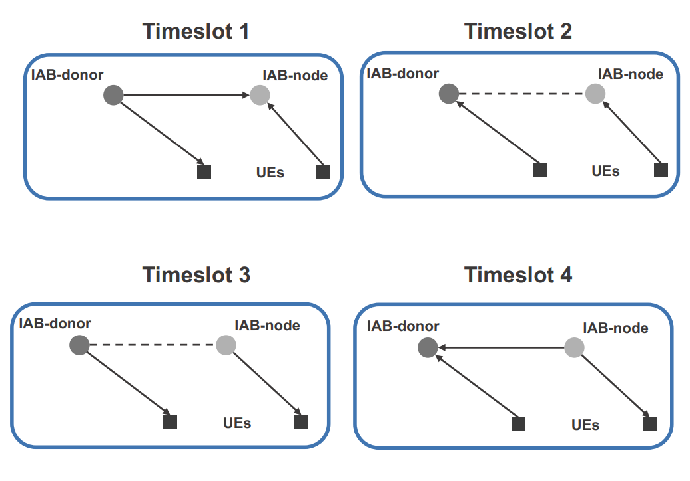
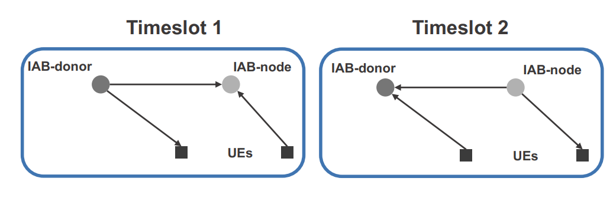

# IAB-Sim

### How to run the simulation

Launch **run_sim.py** to start the simulation with the configured parameters. The main module does not have any input arguments.
All system parameters are configured withing the global variables class located in **gl_vars.py**.

### Simulations with and without optimization

#### Optimization

The frame patter in this framework is assumed to be split in 4 sub-frames:

The duration of these sub-frames is optimized together with the slot allocations to UEs. 
While the frame division coefficients explicitly determine
the number of UL and DL slots in the simulation, the allocations for UEs are given as weights for schedulers.
These weights prioritize the transmission orders in one of the two available scheduling options, 
namely, weighted proportional fair (WPF) and weighted round robin, which
is called weighted fair queuing (WFQ) in the model.

Note that optimization is continuous and all results are rounded to the nearest integer
in the simulator, which causes deviations from the optimal solution. In addition, optimization
does not provide an answer on how to schedule UEs within the backhaul, it just tells
how much time should be allocated for backhaul links but it does not specify, 
which UEs should transmit over the backhaul link.

#### How to run simulations with optimal slot allocations

As it was mentioned, optimization problem is solved under the full buffer traffic assumption. 
Therefore, to run simulations with optimal slot allocations the following parameters should be configured as follows.
First, set **frame_division_policy = 'OPT'** to enable optimization.
Then, set traffic type to full-buffer by setting **traffic_type = 'full'** (this is needed for the correct throughput calculations).
Finally, set the burst size **burst_size_bytes** to **large**, to emulate the full buffer behavior.

#### Simulations without optimal allocations

When optimization is disabled, there are 2 heuristic options available for the frame split, i.e., '50/50' and 'PF'.
Moreover, when using non-optimal approach, the frame is assumed to be divided into 2 sub-frames as follows:

This basically means that heuristic approaches only use the first and the last slots from the optmization.

### Description of the parameters

#### General simulation parameters
Random simulation seed and simulation duration are set up here. Note that the simulation duration is given in internal simulation tics. 
One tic corresponds to the duration of one UL/DL interval in a frame, e.g., if there are multiple consequent slots in a frame, one tic duration equal to the number of these slots multiplied by the duration of a single slot.

#### Deployment configuration
This section defines basic deployment configurations such as the cell radius, carrier frequency, bandwidth, heights of UEs and IAB nodes, etc.
All heights are assumed to be in meters while the frequency and bandwidth are in Hz. 

There are three different options available for establishing UE associations: 
1 - best RSRP when UEs choose the strongest link (best_rsrp_maxmin); 
2 - minimum number of hops when UEs always try to connect to the DgNB and choose IAB nodes only if the direct link is not available (min_hops);
3 - random associations (rand).

#### Scheduling and Optimization

These parameters describe scheduling and optimization settings. 
- To enable optimization, frame_division_policy should be set to 'OPT'. See the previous section for other parameters, which should be
configured to enable optimized access and backhaul allocations and UE schedulling. 
- To use the average path loss (PL) values in the optimization use_average should be True, otherwise, instant PL values will be used.
- There are 2 cost functions available for the optimization framework, i.e, 'MAXMIN' or 'PF' (maxmin fairness and proportional fairness). With maxmin optimization, 
the algorithm will try to maximize the minimum achievable rate among UEs and equalize the rates for all UEs.
- There are two basic schedulers implemented: round robin and proportional fair. To use them without optimal coefficients, switch the scheduler 
parameter to 'PF' or 'RR'. To compliment the scheduler with the optimal coefficients choose between the 'WFQ' or 'WPF'.

#### Channel calculation and blockage

This set of parameters is responsible for channel configuration: 
- channel_update_periodicity_tics sets the frequency of channel updates (if mobility is disabled, one can put a large value while for fast-moving UEs this value should be small), 
- PL_calculation_option allows choosing the channel model (option 'simple' uses just PL formulas while 'cluster' uses the 3GPP cluster channel model to generate
multipath components), 
- shadow_fading is the flag enabling/disabling the addition of fading component used for the simple channel model,
- blockers_density dictates the density of blockers per square meter. More details on the blockage model can be found in [1].
To enable link blockage, set blockage to True, loss_from_blockage_dB gives the signal attenuation due to blockage.

**!Note** that the impact of blockage might not be visible on the results of the optimization because optimization is solved at t=0 and links might 
not be blocked at this time, link blockage occurs further as the process in time and degrades the performance of the optimal allocations.
Also, ensure that the simulation time is large enough so that the tossed blockage time is achieved. 

#### Physical parameters of UEs and nodes/DgNB

Set up here such parameters as transmit power, noise figure, interference margin, and the number of antenna 
elements.

#### Packet transmission parameters 

The sizes of packet and burst. As it was mentioned previously,
the burst size for full-buffer traffic should be set to a large number, which will not be transmitted.

#### UE mobility configurations

Choose a mobility pattern from 3 possible options: stable (no mobility), random direction mobility (RDM), and reference point group mobility(RPGM).
Set up minimum and average speeds in m/s.

#### OFDM-related parameters

Chose the numerology number, frame duration is by default 10 ms (but it can be changed in the simulator if needed),
and target BLER.

#### Printing, Plotting, and Saving

Flags for plotting deployment and optimization results as well as printing the simulation process.  

[1] M. Gapeyenko, A. Samuylov, M. Gerasimenko, D. Moltchanov, S. Singh, M. R. Akdeniz, E. Aryafar, N. Himayat, S. Andreev, and
Y. Koucheryavy, “On the temporal effects of mobile blockers in urban millimeter-wave cellular scenarios,” IEEE Transactions on Vehicular
Technology, vol. 66, no. 11, pp. 10124–10138, 2017
